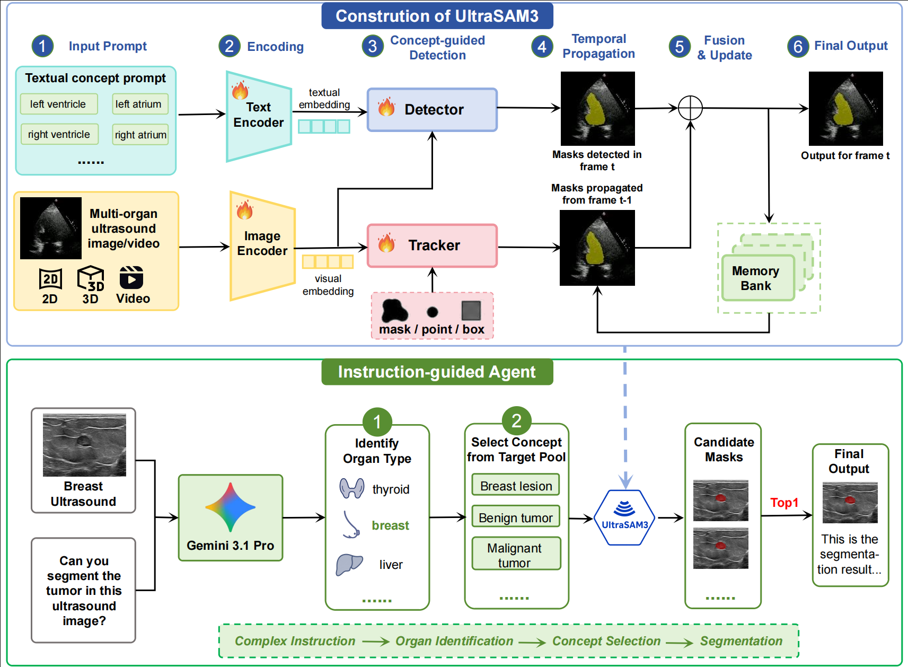
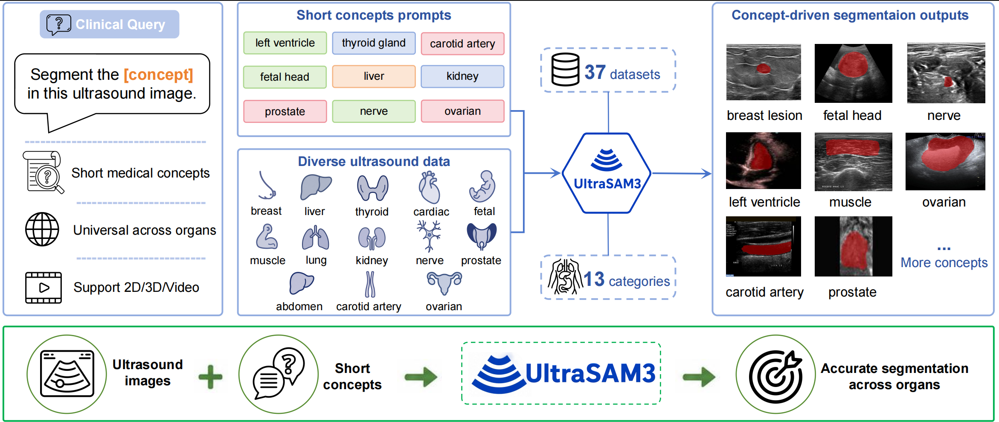

<div align="center">
  
  <h1>US-SAM3: A Concept-Driven Foundation Model for Universal Ultrasound Image Segmentation</h1>
  
  <h3>Introduction</h3>
  <a href="https://github.com/zhuqh19/US-SAM3">
    
  </a> 

  <h3>Framework</h3>
  <a href="https://github.com/zhuqh19/US-SAM3">
    
  </a>

</div>

## 📰 News
<!-- * **[2026-05-26]**: 📄 Paper is available on arXiv. -->
* **[2026-05-26]**: 🚀 Pretrained weights for US-SAM3 are released!

## 📚 Training Datasets

The following table lists the 37 ultrasound datasets used by US-SAM3 and their corresponding paper or source titles.

| Dataset                      | Paper / Source Title                                         |
| ---------------------------- | ------------------------------------------------------------ |
| `LUSS`                       | Lung ultrasound covid phantom dataset used for training machine learning model |
| `STMUS_NDA`                  | Deep learning segmentation of transverse musculoskeletal ultrasound images for neuromuscular disease assessment |
| `LUMINOUS`                   | LUMINOUS database: lumbar multifidus muscle segmentation from ultrasound images |
| `FALLMUD`                    | FALLMUD: FAscicle Lower Leg Muscle Ultrasound Dataset        |
| `AbdomenUS`                  | AbdomenUS: US Simulation and Segmentation                    |
| `OTU_2d`                     | MMOTU: A multi-modality ovarian tumor ultrasound image dataset for unsupervised cross-domain semantic segmentation |
| `OTU_3d`                     | MMOTU: A multi-modality ovarian tumor ultrasound image dataset for unsupervised cross-domain semantic segmentation |
| `EchoNet_Dynamic`            | Video-based AI for beat-to-beat assessment of cardiac function |
| `CAMUS`                      | Deep learning for segmentation using an open large-scale dataset in 2D echocardiography |
| `Unity`                      | Unity Imaging Echocardiography Datasets                      |
| `EchoCP`                     | EchoCP: An echocardiography dataset in contrast transthoracic echocardiography for patent foramen ovale diagnosis |
| `EchoNet-Pediatric`          | Video-based deep learning for automated assessment of left ventricular ejection fraction in pediatric patients |
| `CardiacUDC`                 | Graphecho: Graph-driven unsupervised domain adaptation for echocardiogram video segmentation |
| `MicroSeg`                   | Micro-ultrasound prostate segmentation dataset               |
| `RegPro`                     | MR to ultrasound registration for prostate challenge-dataset |
| `Thyroid_US_Cineclip`        | Thyroid Ultrasound Cine-clip                                 |
| `TG3K`                       | Thyroid region prior guided attention for ultrasound segmentation of thyroid nodules |
| `TN3K`                       | Multi-task learning for thyroid nodule segmentation with thyroid region prior |
| `Segthy`                     | Tracked 3D ultrasound and deep neural network-based thyroid segmentation reduce interobserver variability in thyroid volumetry |
| `DDTI`                       | An open access thyroid ultrasound image database             |
| `Annotated_Ultrasound_Liver` | Annotated Ultrasound Liver images                            |
| `Fast_UNet`                  | Fast and accurate U-net model for fetal ultrasound image segmentation |
| `ACOUSLIC`                   | ACOUSLIC-AI challenge report: Fetal abdominal circumference measurement on blind-sweep ultrasound data from low-income countries |
| `fh_ps`                      | Pubic Symphysis-Fetal Head Segmentation and Angle of Progression |
| `FASS`                       | Fetal abdominal structures segmentation dataset using ultrasonic images |
| `focus`                      | Focus: four-chamber ultrasound image dataset for fetal cardiac biometric measurement |
| `HC`                         | Automated measurement of fetal head circumference using 2D ultrasound images |
| `UPBD`                       | MallesNet: A multi-object assistance based network for brachial plexus segmentation in ultrasound images |
| `BUS_DatasetB`               | Automated breast ultrasound lesions detection using convolutional neural networks |
| `BUSI`                       | Dataset of breast ultrasound images                          |
| `BUS_BRA`                    | BUS-BRA: A breast ultrasound dataset for assessing computer-aided diagnosis systems |
| `BUS_UC`                     | Memory-efficient transformer network with feature fusion for breast tumor segmentation and classification task |
| `BUID`                       | An open-access breast lesion ultrasound image database: Applicable in artificial intelligence studies |
| `S1`                         | Segmentation and recognition of breast ultrasound images based on an expanded U-Net |
| `CCA`                        | MI-SegNet: Mutual information-based US segmentation for unseen domain generalization |
| `Ultrasound_Normal_Kidney`   | Ultrasound Normal Kidney Image Dataset                       |
| `KidneyUS`                   | The Open Kidney Ultrasound Data Set                          |

## 🛠️ Environment Setup

For environment configuration and dependency installation, please refer to the following two documents:

- [Training Environment Guide](https://github.com/zhuqh19/US-SAM3/blob/main/code/README_TRAIN.md)
- [Code Environment Guide](https://github.com/zhuqh19/US-SAM3/blob/main/code/README.md)

## 🚀 Single-image Inference

We provide two single-image inference scripts:

- `inference.py`: run US-SAM3 with an image and a direct text prompt, such as `"thyroid nodule"`.
- `inference_agent.py`: run US-SAM3 with an image and a natural-language question. The script first uses an agent/API to rewrite the question into a concise SAM3 prompt, then runs segmentation.

Before running the scripts, please make sure that the SAM3 code, config file, checkpoint, and tokenizer vocabulary paths are correctly set for your local environment.

### 1. Update local paths

The uploaded config contains several machine-specific absolute paths. Please replace them with paths on your own machine before running inference.

At minimum, check and update the following fields in `config/config.yaml`:

```yaml
paths:
  experiment_log_dir: /path/to/your/log_dir
  bpe_path: /path/to/US-SAM3/code/assets/bpe_simple_vocab_16e6.txt.gz

trainer:
  model:
    bpe_path: /path/to/US-SAM3/code/assets/bpe_simple_vocab_16e6.txt.gz
    checkpoint_path: /path/to/sam3_or_us_sam3_checkpoint.pt

  meters:
    val:
      roboflow100:
        detection:
          dump_dir: /path/to/your/log_dir/dumps/val
```

If you use the config for dataset-level training/evaluation, also update every dataset path under:

```yaml
trainer.data.train.dataset.datasets[*].img_folder
trainer.data.train.dataset.datasets[*].ann_file
trainer.data.val.dataset.img_folder
trainer.data.val.dataset.ann_file
trainer.meters.val.roboflow100.detection.pred_file_evaluators[0].gt_path
```

For the two single-image scripts below, the validation image folder and annotation file are automatically replaced at runtime, so you usually only need to ensure that the SAM3 code path, config path, checkpoint path, and BPE vocabulary path are valid.

You can either edit the default constants inside the scripts or, preferably, pass the paths from the command line.

### 2. Direct text-prompt inference

Use `inference.py` when you already know the target concept prompt.

```bash
python inference.py \
  --image /path/to/image.png \
  --prompt "thyroid nodule" \
  --sam3-code-dir /path/to/US-SAM3/code \
  --sam3-config /path/to/US-SAM3/config/config.yaml \
  --checkpoint /path/to/US-SAM3_weight/US-SAM3.pt \
  --output-root ./sam3_single_image_outputs \
  --cuda-visible-devices 0
```

Main arguments:

- `--image`: input ultrasound image.
- `--prompt`: target object/anatomy/pathology name used as the SAM3 text prompt.
- `--sam3-code-dir`: path to the SAM3 code directory.
- `--sam3-config`: path to the Hydra config file.
- `--checkpoint`: path to the US-SAM3 checkpoint.
- `--output-root`: directory where masks, overlays, metadata, and logs will be saved.
- `--cuda-visible-devices`: optional GPU id, for example `0`.

The script saves a binary mask, an overlay visualization, metadata, raw predictions, and the validation log under `--output-root`.

### 3. Agent-based question inference

Use `inference_agent.py` when you want to provide a natural-language question instead of manually writing the exact SAM3 prompt.

```bash
python inference_agent.py \
  --image /path/to/image.png \
  --question "Please segment the thyroid nodule in this ultrasound image." \
  --sam3-code-dir /path/to/US-SAM3/code \
  --config-path /path/to/US-SAM3/config/config.yaml \
  --checkpoint-path /path/to/US-SAM3_weight/US-SAM3.pt \
  --api-key $OPENAI_API_KEY \
  --api-url https://your-api-endpoint/v1/chat/completions \
  --api-model your-api-model \
  --output-root ./sam3_agent_single_image_outputs \
  --cuda-visible-devices 0
```

Main arguments:

- `--image`: input ultrasound image.
- `--question`: natural-language segmentation request.
- `--sam3-code-dir`: path to the SAM3 code directory.
- `--config-path`: path to the Hydra config file.
- `--checkpoint-path`: path to the US-SAM3 checkpoint.
- `--api-key`, `--api-url`, `--api-model`: API settings for the front-end agent.
- `--categories`: optional comma-separated target category list shown to the agent.
- `--categories-file`: optional `.txt` or `.json` category list.
- `--no-api`: skip the API agent and use the local fallback prompt parser.
- `--min-area`, `--max-area-ratio`: optional filters for predicted masks.
- `--remove-overlap`: optionally apply SAM3 overlap removal if available.

If you do not want to use an API, run:

```bash
python inference_agent.py \
  --image /path/to/image.png \
  --question "Please segment the thyroid nodule in this ultrasound image." \
  --sam3-code-dir /path/to/US-SAM3/code \
  --config-path /path/to/US-SAM3/config/config.yaml \
  --checkpoint-path /path/to/US-SAM3_weight/US-SAM3.pt \
  --no-api
```

The agent-based script saves the top-1 mask, overlay, candidate masks, parsed agent response, metadata, and run directory under `--output-root`.

### 4. Output files

Both scripts print the saved file paths after inference. The most useful outputs are:

- `*_top1_mask.png` or `*_agent_top1_mask.png`: binary segmentation mask.
- `*_top1_overlay.png` or `*_agent_top1_overlay.png`: image overlay for visualization.
- `*_meta.json` or `*_agent_meta.json`: prompt, checkpoint/config paths, scores, area, and output locations.
- `run_val_stdout.txt` or `*_agent_raw_response.txt`: logs or raw agent response for debugging.


## 📝 Citation

If you find US-SAM3 useful for your research or work, please consider citing our paper:

```bibtex

}